<!--
=========================================================
AquaPrint AI — Complete Development Blueprint
Professional GitHub Documentation
=========================================================
-->

<div align="center">

# 🌊 AquaPrint AI

## Complete Development Blueprint

**AI-Powered Water Footprint Awareness Platform**


</div>

---

> **This document is the complete technical blueprint for AquaPrint AI.**
>
> It includes architecture, workflows, database design, API specifications,
> implementation strategy, deployment, and engineering decisions.

## 📑 Table of Contents

- [Project Understanding](#1-project-understanding)
- [Functional Modules](#2-functional-modules)
- [Non-Functional Requirements](#3-non-functional-requirements)
- [System Architecture](#4-system-architecture)
- [Folder Structure](#5-folder-structure)
- [Frontend Architecture](#6-frontend-architecture)
- [Backend Architecture](#7-backend-architecture)
- [Database Architecture](#8-database-architecture)
- [API Architecture](#9-api-architecture)
- [Authentication Flow](#10-authentication-flow)
- [AI Workflow](#11-ai-workflow)
- [Scanner Workflow](#12-scanner-workflow)
- [OCR Workflow](#13-ocr-workflow)
- [Barcode Workflow](#14-barcode-workflow)
- [State Management Strategy](#15-state-management-strategy)
- [PWA Strategy](#16-pwa-strategy)
- [Offline Strategy](#17-offline-strategy)

---

> **Project**: AquaPrint AI – Water Footprint Awareness Platform
> **Problem Statement**: SIH 2024 — Ministry of Jal Shakti — Consumer water footprint awareness tool
> **Source Documents**: SRS Deep Research Report, SIH Executive Summary, Stitch UI Design System (21 screens)
> **Status**: 🔵 AWAITING APPROVAL — No code will be generated until this blueprint is approved.

---

## 📌 1. Project Understanding

### 1.1 Problem Domain
India faces a critical freshwater scarcity crisis. The Ministry of Jal Shakti (via SIH) identifies a fundamental **information asymmetry**: consumers have zero visibility into the "virtual water" embedded in the products they purchase daily. A cotton t-shirt consumes ~2,500L of water; a smartphone ~12,000L. Without this data at the point of decision-making, behavioral change toward sustainable consumption is impossible.

### 1.2 What AquaPrint AI Solves
AquaPrint AI is a **Website + Progressive Web App (PWA)** that democratizes water footprint data through:
- **AI-powered product recognition** (image scan, barcode, OCR, text search)
- **ISO 14046 AWARE-adjusted footprint calculations** (Blue + Green + Grey water, weighted by regional scarcity)
- **Educational gamification** (eco-scores, badges, leaderboards, daily challenges)
- **Offline-first architecture** for rural India with intermittent connectivity

### 1.3 Alignment with National & Global Mandates
| Mandate | How AquaPrint AI Aligns |
|---------|------------------------|
| **UN SDG 6.4** | Increases water-use efficiency awareness at consumer level |
| **Jal Jeevan Mission** | Provides localized conservation advice using AWARE methodology |
| **SIH Problem Statement** | Directly addresses Ministry of Jal Shakti's call for digital water awareness tools |

### 1.4 Target Users (from SRS Personas)
| Persona | Description | Key Needs |
|---------|-------------|-----------|
| **Ramesh** (45, Rural Farmer) | Low-end Android, intermittent 3G, Marathi speaker | Offline mode, multilingual, crop comparison |
| **Priya** (22, Urban Student) | High-end smartphone, 5G, environmentally conscious | Barcode scanning, gamification, social sharing |
| **Dr. Sharma** (50, Policy Maker) | Desktop, data-driven decisions | Analytics dashboard, aggregated trends |

### 1.5 Technology Stack Decisions

> [!IMPORTANT]
> The technology stack specified by the user **overrides** the SRS document's original stack (which used React SPA + Node.js + TensorFlow.js). We adopt the user's production-grade stack while preserving all SRS functional requirements.

| Layer | SRS Original | **Our Stack (User-Specified)** | Rationale |
|-------|-------------|-------------------------------|-----------|
| Frontend Framework | React SPA + Vite | **Next.js 15 (App Router)** | SSR/SSG for SEO, route-level code splitting, built-in image optimization, API routes |
| React Version | React 18 | **React 19** | Server Components, Actions, useOptimistic for forms |
| Language | JavaScript | **TypeScript** | Type safety across 21+ screens and complex AI workflows |
| Styling | CSS + Tailwind | **Tailwind CSS + shadcn/ui** | Matches Stitch design tokens directly; shadcn provides accessible primitives |
| Animation | CSS transforms | **Framer Motion** | Declarative animations matching Stitch's glassmorphic micro-interactions |
| State Mgmt | useState/Zustand | **Zustand** | Lightweight, TypeScript-friendly, no boilerplate |
| Server State | None | **TanStack Query** | Caching, background sync, optimistic updates for API data |
| Backend | Node.js + Express | **FastAPI (Python)** | Async-first, automatic OpenAPI docs, Pydantic validation, Gemini SDK support |
| Database | PostgreSQL (raw) | **PostgreSQL via Supabase** | Managed DB, real-time subscriptions, built-in auth, row-level security |
| ORM | None | **SQLAlchemy** | Mature Python ORM, migration support via Alembic |
| Auth | JWT + OAuth | **Supabase Auth + Google OAuth** | Managed auth with social login, session management, RLS integration |
| AI | TensorFlow.js | **Google Gemini + Google Vision API** | Server-side AI for higher accuracy; Gemini for conversational AI assistant |
| Deployment | AWS ECS + S3 | **Vercel (frontend) + Render (backend) + Supabase (DB)** | Zero-config deployment, serverless scaling, cost-effective |

---

## 🧩 2. Functional Modules

Based on analysis of the SRS (Sections 8, 16, 17) and all 21 Stitch UI screens, the application decomposes into **12 functional modules**:

| # | Module | Stitch Screens Mapped | SRS FR Mapping |
|---|--------|----------------------|----------------|
| M1 | **Landing & Marketing** | `aquaprint_ai_landing_page` | — |
| M2 | **Authentication** | `sign_in`, `create_account`, `forgot_password`, `otp_verification`, `aquaprint_ai_authentication_flow` | FR-Auth (Section 27) |
| M3 | **Dashboard** | `dashboard`, `advanced_dashboard` | FR-04, FR-05 |
| M4 | **AI Product Scanner** | `ai_product_scanner` | FR-01, FR-02, FR-03 |
| M5 | **Product Details** | `product_details` | FR-04, FR-05 |
| M6 | **Product Comparison** | `product_comparison` | FR-04 |
| M7 | **Advanced Search** | `advanced_search` | FR-07 |
| M8 | **Water Tracking** | `water_tracking` | FR-04 |
| M9 | **Environmental Impact** | `environmental_impact` | FR-05 |
| M10 | **AI Sustainability Assistant** | `ai_sustainability_assistant` | FR-AI (Section 18) |
| M11 | **Profile & Gamification** | `profile` | FR-Gamification (Section 16.5) |
| M12 | **Settings** | `settings` | FR-06 |

### Module Dependency Graph
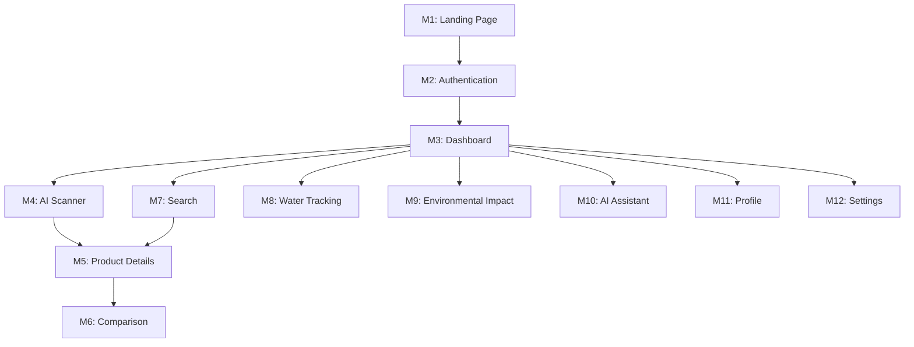

---

## ⚡ 3. Non-Functional Requirements

Derived from SRS Section 9, enhanced for production deployment:

| ID | Requirement | Target | Verification Method |
|----|-------------|--------|-------------------|
| NFR-01 | **First Contentful Paint** | < 1.5s on 4G | Lighthouse CI in pipeline |
| NFR-02 | **Time to Interactive** | < 3.0s on 3G | WebPageTest |
| NFR-03 | **Lighthouse Score** | > 90 (Performance, Accessibility, SEO, Best Practices) | Automated CI check |
| NFR-04 | **PWA Installability** | Full offline shell, A2HS prompt | Manual + Lighthouse PWA audit |
| NFR-05 | **Offline Resilience** | Core search + cached results work offline | Cypress offline simulation |
| NFR-06 | **WCAG 2.1 AA** | 4.5:1 contrast, ARIA labels, keyboard nav | axe-core automated checks |
| NFR-07 | **Bundle Size** | Initial JS < 200KB gzipped | webpack-bundle-analyzer |
| NFR-08 | **API Response Time** | p95 < 500ms | FastAPI middleware logging |
| NFR-09 | **Cross-Browser** | Chrome 90+, Safari 15+, Firefox 100+, Samsung Internet | BrowserStack matrix |
| NFR-10 | **Data Privacy** | No PII in logs, HTTPS only, CSP headers | Security audit |
| NFR-11 | **Multilingual** | English + Hindi minimum, extensible | i18n test coverage |

---

## 🏗️ 4. System Architecture

### 4.1 High-Level Architecture

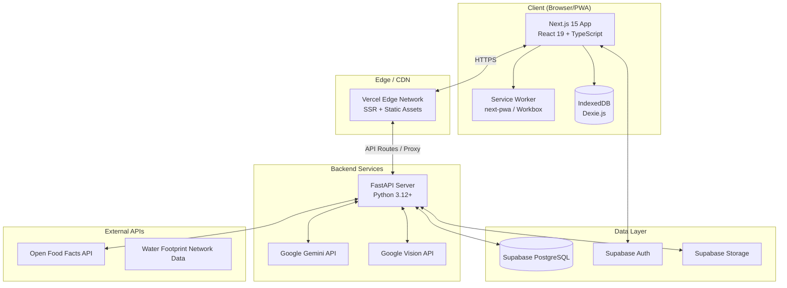

### 4.2 Why This Architecture?

| Decision | Rationale |
|----------|-----------|
| **Next.js App Router over SPA** | SEO for landing page, route-level code splitting reduces initial bundle, Server Components for data-heavy pages, API routes can proxy to FastAPI |
| **FastAPI over Node.js** | Python ecosystem for AI/ML (Gemini SDK, Vision API client), Pydantic models for automatic validation, async/await for high concurrency, auto-generated OpenAPI docs |
| **Supabase over raw PostgreSQL** | Managed infrastructure (no DevOps overhead), built-in auth with Google OAuth, real-time subscriptions for leaderboards, Row Level Security for multi-tenant data isolation |
| **Server-side AI over client-side TF.js** | Google Gemini provides far superior accuracy over client-side MobileNet; Vision API handles barcode/OCR with production reliability; eliminates 3-5MB client model download |
| **Vercel + Render split** | Vercel optimized for Next.js (edge functions, ISR, image optimization); Render provides persistent Python server with WebSocket support for AI assistant |

---

## 📂 5. Folder Structure

```
AquaPrintAI/
├── frontend/                          # Next.js 15 Application
│   ├── public/
│   │   ├── icons/                     # PWA icons (192x192, 512x512)
│   │   ├── manifest.json             # PWA manifest
│   │   ├── sw.js                      # Service worker (generated)
│   │   └── locales/                   # i18n translation files
│   │       ├── en/
│   │       │   └── common.json
│   │       └── hi/
│   │           └── common.json
│   ├── src/
│   │   ├── app/                       # Next.js App Router
│   │   │   ├── layout.tsx             # Root layout (fonts, providers, metadata)
│   │   │   ├── page.tsx               # Landing page (M1)
│   │   │   ├── (auth)/               # Auth route group
│   │   │   │   ├── sign-in/page.tsx
│   │   │   │   ├── register/page.tsx
│   │   │   │   ├── forgot-password/page.tsx
│   │   │   │   └── verify-otp/page.tsx
│   │   │   ├── (app)/                # Authenticated app route group
│   │   │   │   ├── layout.tsx         # App shell (nav, bottom bar)
│   │   │   │   ├── dashboard/page.tsx
│   │   │   │   ├── scanner/page.tsx
│   │   │   │   ├── search/page.tsx
│   │   │   │   ├── product/[id]/page.tsx
│   │   │   │   ├── compare/page.tsx
│   │   │   │   ├── tracking/page.tsx
│   │   │   │   ├── impact/page.tsx
│   │   │   │   ├── assistant/page.tsx
│   │   │   │   ├── profile/page.tsx
│   │   │   │   └── settings/page.tsx
│   │   │   └── api/                   # Next.js API routes (proxy layer)
│   │   │       └── [...proxy]/route.ts
│   │   ├── components/
│   │   │   ├── ui/                    # shadcn/ui primitives
│   │   │   │   ├── button.tsx
│   │   │   │   ├── card.tsx
│   │   │   │   ├── input.tsx
│   │   │   │   ├── dialog.tsx
│   │   │   │   ├── sheet.tsx
│   │   │   │   ├── tabs.tsx
│   │   │   │   ├── badge.tsx
│   │   │   │   ├── progress.tsx
│   │   │   │   ├── skeleton.tsx
│   │   │   │   ├── toast.tsx
│   │   │   │   └── ...
│   │   │   ├── layout/               # Layout components
│   │   │   │   ├── top-app-bar.tsx
│   │   │   │   ├── bottom-nav.tsx
│   │   │   │   ├── sidebar.tsx
│   │   │   │   └── mobile-menu.tsx
│   │   │   ├── landing/              # Landing page sections
│   │   │   │   ├── hero-section.tsx
│   │   │   │   ├── stats-section.tsx
│   │   │   │   ├── how-it-works.tsx
│   │   │   │   ├── categories-carousel.tsx
│   │   │   │   ├── scanner-preview.tsx
│   │   │   │   ├── impact-section.tsx
│   │   │   │   ├── features-grid.tsx
│   │   │   │   ├── testimonials.tsx
│   │   │   │   ├── faq-accordion.tsx
│   │   │   │   ├── newsletter.tsx
│   │   │   │   └── footer.tsx
│   │   │   ├── auth/                 # Authentication components
│   │   │   │   ├── sign-in-form.tsx
│   │   │   │   ├── register-form.tsx
│   │   │   │   ├── otp-input.tsx
│   │   │   │   ├── google-auth-button.tsx
│   │   │   │   └── guest-mode-button.tsx
│   │   │   ├── dashboard/            # Dashboard components
│   │   │   │   ├── water-drop-progress.tsx
│   │   │   │   ├── hydration-grid.tsx
│   │   │   │   ├── daily-insight-card.tsx
│   │   │   │   ├── eco-score-card.tsx
│   │   │   │   ├── weekly-chart.tsx
│   │   │   │   ├── stats-grid.tsx
│   │   │   │   ├── category-donut.tsx
│   │   │   │   ├── recent-activity.tsx
│   │   │   │   ├── daily-challenge.tsx
│   │   │   │   └── community-leaderboard.tsx
│   │   │   ├── scanner/              # Scanner components
│   │   │   │   ├── camera-viewfinder.tsx
│   │   │   │   ├── scan-mode-tabs.tsx
│   │   │   │   ├── capture-button.tsx
│   │   │   │   ├── scan-result-sheet.tsx
│   │   │   │   └── detection-overlay.tsx
│   │   │   ├── product/              # Product components
│   │   │   │   ├── product-hero.tsx
│   │   │   │   ├── footprint-metrics.tsx
│   │   │   │   ├── water-breakdown.tsx
│   │   │   │   ├── traceability-timeline.tsx
│   │   │   │   ├── certifications.tsx
│   │   │   │   ├── care-tips.tsx
│   │   │   │   └── alternatives-carousel.tsx
│   │   │   ├── search/               # Search components
│   │   │   │   ├── search-input.tsx
│   │   │   │   ├── filter-panel.tsx
│   │   │   │   ├── ai-insights.tsx
│   │   │   │   ├── recent-searches.tsx
│   │   │   │   └── trending-products.tsx
│   │   │   ├── comparison/           # Comparison components
│   │   │   │   ├── comparison-card.tsx
│   │   │   │   ├── savings-summary.tsx
│   │   │   │   └── recommendation-badge.tsx
│   │   │   ├── tracking/             # Water tracking components
│   │   │   │   ├── consumption-header.tsx
│   │   │   │   ├── ai-insight-card.tsx
│   │   │   │   ├── timeline-entry.tsx
│   │   │   │   └── eco-impact-banner.tsx
│   │   │   ├── impact/               # Environmental impact components
│   │   │   │   ├── realtime-chart.tsx
│   │   │   │   ├── global-rank-card.tsx
│   │   │   │   ├── efficiency-metrics.tsx
│   │   │   │   └── optimization-card.tsx
│   │   │   ├── assistant/            # AI assistant components
│   │   │   │   ├── chat-message.tsx
│   │   │   │   ├── chat-input.tsx
│   │   │   │   ├── quick-prompts.tsx
│   │   │   │   └── typing-indicator.tsx
│   │   │   ├── profile/              # Profile components
│   │   │   │   ├── profile-header.tsx
│   │   │   │   ├── impact-circles.tsx
│   │   │   │   ├── badges-grid.tsx
│   │   │   │   ├── scan-history.tsx
│   │   │   │   └── saved-products.tsx
│   │   │   └── shared/               # Shared components
│   │   │       ├── glass-card.tsx
│   │   │       ├── water-shader.tsx
│   │   │       ├── globe-3d.tsx
│   │   │       ├── loading-skeleton.tsx
│   │   │       ├── error-boundary.tsx
│   │   │       └── offline-indicator.tsx
│   │   ├── hooks/                     # Custom React hooks
│   │   │   ├── use-camera.ts
│   │   │   ├── use-barcode-scanner.ts
│   │   │   ├── use-online-status.ts
│   │   │   ├── use-geolocation.ts
│   │   │   ├── use-media-query.ts
│   │   │   ├── use-local-storage.ts
│   │   │   └── use-debounce.ts
│   │   ├── lib/                       # Utilities & configurations
│   │   │   ├── supabase/
│   │   │   │   ├── client.ts          # Browser Supabase client
│   │   │   │   ├── server.ts          # Server-side Supabase client
│   │   │   │   └── middleware.ts      # Auth middleware
│   │   │   ├── api/
│   │   │   │   ├── client.ts          # Axios/fetch wrapper for FastAPI
│   │   │   │   └── endpoints.ts       # API endpoint constants
│   │   │   ├── utils/
│   │   │   │   ├── cn.ts              # clsx + tailwind-merge
│   │   │   │   ├── formatters.ts      # Number/date formatters
│   │   │   │   └── constants.ts       # App-wide constants
│   │   │   └── i18n/
│   │   │       ├── config.ts
│   │   │       └── dictionaries.ts
│   │   ├── stores/                    # Zustand stores
│   │   │   ├── auth-store.ts
│   │   │   ├── scanner-store.ts
│   │   │   ├── search-store.ts
│   │   │   ├── settings-store.ts
│   │   │   └── ui-store.ts
│   │   ├── queries/                   # TanStack Query definitions
│   │   │   ├── products.ts
│   │   │   ├── scans.ts
│   │   │   ├── user.ts
│   │   │   ├── leaderboard.ts
│   │   │   └── assistant.ts
│   │   ├── types/                     # TypeScript type definitions
│   │   │   ├── product.ts
│   │   │   ├── user.ts
│   │   │   ├── scan.ts
│   │   │   ├── footprint.ts
│   │   │   └── api.ts
│   │   └── styles/
│   │       └── globals.css            # Tailwind + design system tokens
│   ├── next.config.ts
│   ├── tailwind.config.ts
│   ├── tsconfig.json
│   ├── components.json                # shadcn/ui config
│   └── package.json
│
├── backend/                           # FastAPI Application
│   ├── app/
│   │   ├── main.py                    # FastAPI app entry point
│   │   ├── config.py                  # Settings (env vars, Pydantic BaseSettings)
│   │   ├── database.py                # SQLAlchemy engine + session
│   │   ├── models/                    # SQLAlchemy ORM models
│   │   │   ├── __init__.py
│   │   │   ├── user.py
│   │   │   ├── product.py
│   │   │   ├── scan.py
│   │   │   ├── wf_metrics.py
│   │   │   └── badge.py
│   │   ├── schemas/                   # Pydantic request/response schemas
│   │   │   ├── __init__.py
│   │   │   ├── product.py
│   │   │   ├── scan.py
│   │   │   ├── user.py
│   │   │   └── ai.py
│   │   ├── routers/                   # API route handlers
│   │   │   ├── __init__.py
│   │   │   ├── products.py
│   │   │   ├── scans.py
│   │   │   ├── search.py
│   │   │   ├── ai.py
│   │   │   ├── auth.py
│   │   │   └── leaderboard.py
│   │   ├── services/                  # Business logic layer
│   │   │   ├── __init__.py
│   │   │   ├── product_service.py
│   │   │   ├── scan_service.py
│   │   │   ├── footprint_calculator.py
│   │   │   ├── gemini_service.py
│   │   │   ├── vision_service.py
│   │   │   ├── ocr_service.py
│   │   │   ├── barcode_service.py
│   │   │   └── gamification_service.py
│   │   ├── middleware/                # FastAPI middleware
│   │   │   ├── cors.py
│   │   │   ├── rate_limiter.py
│   │   │   └── auth.py
│   │   └── utils/
│   │       ├── aware_factors.py       # ISO 14046 AWARE calculation
│   │       └── validators.py
│   ├── alembic/                       # Database migrations
│   │   ├── versions/
│   │   └── env.py
│   ├── tests/
│   │   ├── test_products.py
│   │   ├── test_footprint.py
│   │   └── test_ai.py
│   ├── data/
│   │   └── seed/                      # Seed data
│   │       ├── products.json
│   │       ├── aware_factors.json
│   │       └── categories.json
│   ├── alembic.ini
│   ├── requirements.txt
│   ├── Dockerfile
│   └── pyproject.toml
│
├── .github/
│   └── workflows/
│       ├── frontend-ci.yml
│       ├── backend-ci.yml
│       └── deploy.yml
│
├── .env.example
├── .gitignore
├── README.md
├── CONTRIBUTING.md
└── docker-compose.yml                 # Local development
```

### Why This Structure?

| Decision | Rationale |
|----------|-----------|
| **Monorepo with `frontend/` + `backend/`** | Keeps both codebases in sync with shared `.env`, enables atomic PRs, simplifies CI/CD. No need for Turborepo complexity with only 2 packages. |
| **Next.js Route Groups `(auth)` / `(app)`** | Different layouts: auth pages have no bottom nav; app pages share the navigation shell. Clean separation without nesting. |
| **Component co-location by feature** | Each module's components live in `components/{module}/`. This prevents a flat `components/` folder from growing to 100+ files. |
| **`queries/` directory** | TanStack Query definitions centralized for reuse across components. Keeps data fetching logic separate from UI. |
| **`stores/` directory** | Zustand stores separated from components. Each store is a self-contained slice — no monolithic state. |
| **FastAPI `services/` layer** | Business logic lives in services, not routers. Routers stay thin (validation + delegation). This enables unit testing services independently. |

---

## 🎨 6. Frontend Architecture

### 6.1 Component Architecture

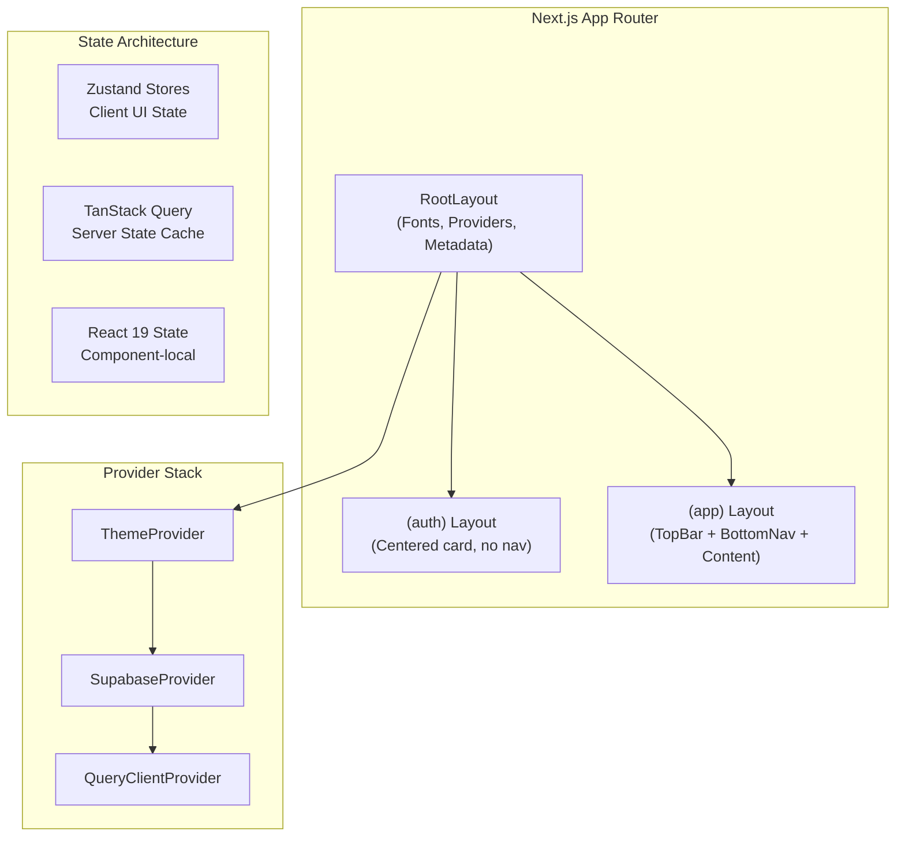

### 6.2 State Ownership Rules

| State Category | Manager | Examples | Why |
|---------------|---------|----------|-----|
| **Server State** (API data) | TanStack Query | Products, scans, leaderboard, user profile | Automatic caching, deduplication, background refetch, optimistic updates |
| **Client Global State** | Zustand | Theme, language, scanner mode, sidebar open/closed | Lightweight, no provider wrapping, TypeScript-friendly, persists via middleware |
| **Form State** | React 19 `useActionState` | Sign-in form, settings form, search filters | Co-located with the form, Server Actions integration |
| **Component-local State** | `useState` / `useReducer` | Modal open, tooltip visible, animation state | Ephemeral, no need to share |
| **URL State** | Next.js `searchParams` | Search query, filter selections, pagination | Shareable URLs, SSR-compatible |

### 6.3 Design System Integration

The Stitch design system maps directly to Tailwind CSS configuration:

```
Stitch Token → Tailwind Config Mapping:
──────────────────────────────────────────
colors.primary (#006591)     → colors.primary
colors.primary-container     → colors.primary-container (#0EA5E9)
colors.secondary (#006C49)   → colors.secondary
colors.secondary-container   → colors.secondary-container (#6CF8BB)
colors.surface (#F8F9FF)     → colors.surface / bg-background
colors.on-surface (#0B1C30)  → colors.on-surface (text-on-surface)
...46 more color tokens

typography.display           → fontSize.display (64px/700/Geist)
typography.headline-lg       → fontSize.headline-lg (40px/600/Geist)
typography.label-caps        → fontSize.label-caps (12px/500/JetBrains Mono)
...4 more type scales

spacing.unit (4px)           → spacing.unit
spacing.gutter (24px)        → spacing.gutter
spacing.container-max        → max-w-container-max (1280px)
```

### 6.4 Glassmorphism System (from Stitch DESIGN.md)

```css
/* Three elevation levels extracted from Stitch designs */
.glass-card {          /* Level 1: Cards */
  background: rgba(255, 255, 255, 0.1);
  backdrop-filter: blur(20px);
  border: 1px solid rgba(255, 255, 255, 0.2);
}

.glass-modal {         /* Level 2: Modals/Popovers */
  background: rgba(255, 255, 255, 0.15);
  backdrop-filter: blur(40px);
  border: 1px solid rgba(255, 255, 255, 0.2);
  box-shadow: 0 0 30px rgba(0, 101, 145, 0.05);
}

.bottom-nav {          /* Level 3: Floating dock */
  backdrop-filter: blur(60px);
  /* Pill-shaped active indicators */
}
```

### 6.5 Responsive Breakpoints

| Breakpoint | Grid Columns | Gutters | Margins | Target |
|-----------|-------------|---------|---------|--------|
| < 768px | 4-col | 16px | 20px | Mobile (primary) |
| 768-1024px | 8-col | 20px | 32px | Tablet |
| > 1024px | 12-col | 24px | 64px | Desktop |

### 6.6 Animation Strategy (Framer Motion)

| Pattern | Implementation | Stitch Reference |
|---------|---------------|-----------------|
| Page transitions | `AnimatePresence` + `motion.div` with fade-up | `animate-fade-up` in landing page |
| Card hover | `whileHover={{ scale: 1.02 }}` | "elements should slightly lift using scale(1.02)" |
| Water drop progress | Custom SVG path animation | Dashboard water-level animation |
| Loading states | `motion.div` with skeleton pulse | Throughout all screens |
| Bottom nav | `layoutId` for active indicator pill | Floating dock active state |
| Scanner reticle | Continuous corner-bracket animation | AI scanner viewfinder |

---

## ⚙️ 7. Backend Architecture

### 7.1 Layered Architecture

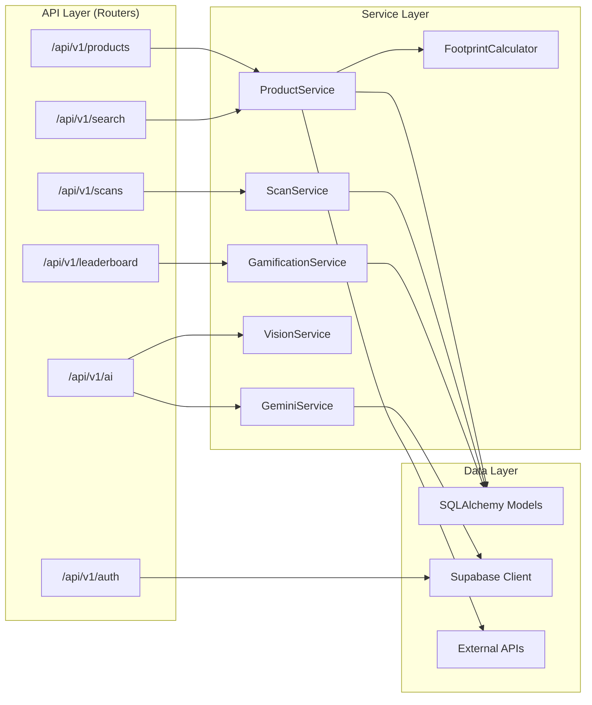

### 7.2 Why FastAPI?

| Feature | Benefit for AquaPrint AI |
|---------|------------------------|
| **Async/await native** | Handles concurrent Gemini + Vision API calls without blocking |
| **Pydantic v2** | Automatic request validation and OpenAPI schema generation |
| **Dependency Injection** | Clean service composition, testability |
| **Auto-generated docs** | `/docs` endpoint for frontend developers |
| **Python ecosystem** | Direct access to google-generativeai SDK, Pillow for image processing |

### 7.3 Middleware Stack

```python
# Applied in order:
1. CORSMiddleware          # Allow frontend origin
2. RateLimitMiddleware     # 100 req/min per IP for AI endpoints
3. AuthMiddleware          # Verify Supabase JWT
4. RequestLoggingMiddleware # Performance monitoring
```

---

## 🗄️ 8. Database Architecture

### 8.1 Entity Relationship Diagram

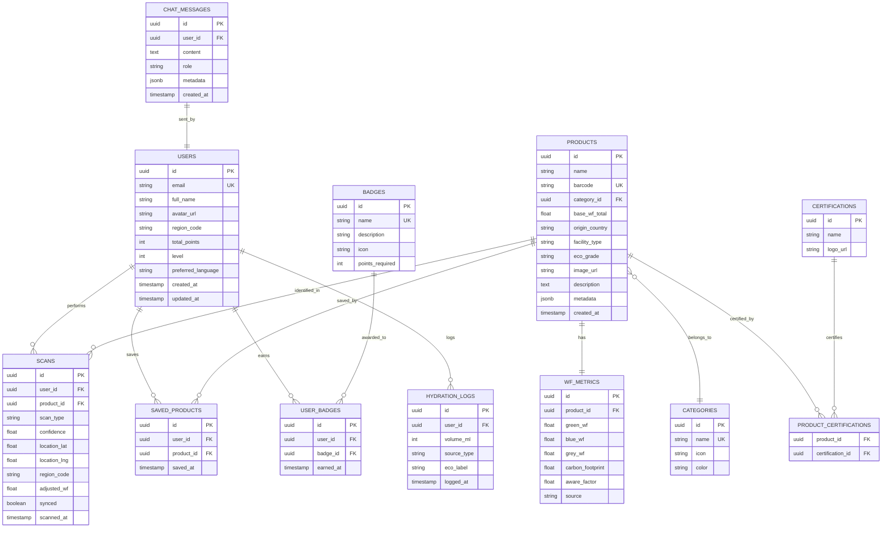

### 8.2 Why This Schema?

| Decision | Rationale |
|----------|-----------|
| **Separate `WF_METRICS` table** | Water footprint data may have multiple sources and revision history; 1:1 with product but logically distinct |
| **`SCANS.adjusted_wf`** | Stores the AWARE-adjusted value at scan time so historical data remains accurate even if AWARE factors update |
| **`SCANS.synced` flag** | Enables offline-first: local scans marked unsynced until background sync succeeds |
| **`HYDRATION_LOGS` table** | Separate from scans — personal water consumption tracking (dashboard feature) vs. product scanning |
| **`CHAT_MESSAGES` table** | Persists AI assistant conversation history per user for contextual follow-ups |
| **`jsonb metadata` on products** | Flexible schema for supplier details, alternative names, regional variants without schema migration |

### 8.3 Indexing Strategy

```sql
-- High-frequency queries
CREATE INDEX idx_products_barcode ON products(barcode);
CREATE INDEX idx_products_name_trgm ON products USING gin(name gin_trgm_ops);  -- Fuzzy search
CREATE INDEX idx_products_category ON products(category_id);
CREATE INDEX idx_scans_user ON scans(user_id, scanned_at DESC);
CREATE INDEX idx_scans_product ON scans(product_id);
CREATE INDEX idx_hydration_user_date ON hydration_logs(user_id, logged_at DESC);
CREATE INDEX idx_users_points ON users(total_points DESC);  -- Leaderboard
```

### 8.4 Row Level Security (Supabase)

```sql
-- Users can only read/write their own data
ALTER TABLE scans ENABLE ROW LEVEL SECURITY;
CREATE POLICY "Users own their scans"
  ON scans FOR ALL
  USING (auth.uid() = user_id);

-- Products are publicly readable
ALTER TABLE products ENABLE ROW LEVEL SECURITY;
CREATE POLICY "Products are public"
  ON products FOR SELECT
  USING (true);
```

---

## 🔌 9. API Architecture

### 9.1 RESTful Endpoint Design

| Endpoint | Method | Description | Auth | Rate Limit |
|----------|--------|-------------|------|-----------|
| **Products** |
| `/api/v1/products/{barcode}` | GET | Get product by barcode | Optional | 200/min |
| `/api/v1/products/{id}` | GET | Get product by ID | Optional | 200/min |
| `/api/v1/products/{id}/alternatives` | GET | Get eco-friendly alternatives | Optional | 100/min |
| **Search** |
| `/api/v1/search` | GET | Full-text fuzzy search (`?q=...&category=...&eco_grade=...&sort=...`) | Optional | 100/min |
| `/api/v1/search/trending` | GET | Trending products | Optional | 50/min |
| **Scans** |
| `/api/v1/scans` | POST | Log a new scan | Required | 60/min |
| `/api/v1/scans/sync` | POST | Bulk sync offline scans | Required | 10/min |
| `/api/v1/scans/history` | GET | User's scan history (paginated) | Required | 100/min |
| **AI** |
| `/api/v1/ai/vision/analyze` | POST | Analyze image (identify product) | Required | 30/min |
| `/api/v1/ai/vision/ocr` | POST | Extract text from image | Required | 30/min |
| `/api/v1/ai/vision/barcode` | POST | Decode barcode from image | Required | 60/min |
| `/api/v1/ai/chat` | POST | AI assistant message | Required | 30/min |
| `/api/v1/ai/chat/history` | GET | Chat history | Required | 100/min |
| **User** |
| `/api/v1/user/profile` | GET/PATCH | Get/update profile | Required | 100/min |
| `/api/v1/user/badges` | GET | Get earned badges | Required | 100/min |
| `/api/v1/user/saved` | GET/POST/DELETE | Saved products | Required | 100/min |
| **Tracking** |
| `/api/v1/tracking/log` | POST | Log hydration | Required | 120/min |
| `/api/v1/tracking/daily` | GET | Daily consumption summary | Required | 100/min |
| `/api/v1/tracking/weekly` | GET | Weekly analytics | Required | 50/min |
| **Leaderboard** |
| `/api/v1/leaderboard` | GET | Global/regional rankings (`?region=...`) | Optional | 50/min |
| **Compare** |
| `/api/v1/compare` | POST | Compare two products (`{product_ids: [id1, id2]}`) | Optional | 60/min |

### 9.2 Response Format

```typescript
// Success
{
  "status": "success",
  "data": { ... },
  "meta": {
    "page": 1,
    "total": 42,
    "per_page": 20
  }
}

// Error
{
  "status": "error",
  "error": {
    "code": "PRODUCT_NOT_FOUND",
    "message": "No product found with barcode 1234567890"
  }
}
```

### 9.3 API Versioning
- URL-based versioning: `/api/v1/...`
- **Why**: Explicit, cache-friendly, easy to deprecate old versions

---

## 🔐 10. Authentication Flow

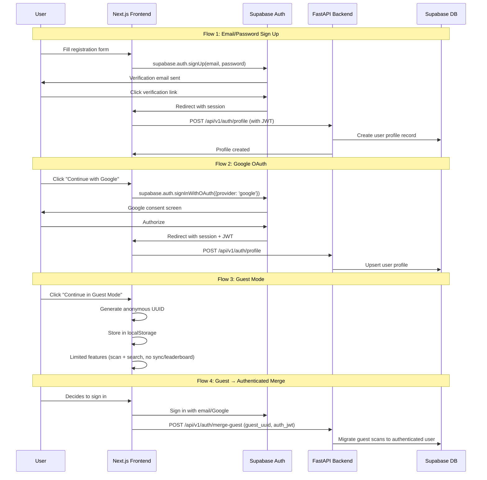

### Auth Decision Rationale

| Decision | Why |
|----------|-----|
| **Supabase Auth over custom JWT** | Managed service handles token rotation, refresh, revocation; built-in Google OAuth; RLS integration |
| **Guest Mode preserved from SRS** | Critical for rural India adoption — no friction barrier for first-time users |
| **Guest→Auth merge** | SRS Section 27 requirement — zero loss of progress when upgrading to authenticated |
| **JWT verification in FastAPI** | Backend validates Supabase JWT using the project's JWT secret; no additional auth server needed |

---

## 🤖 11. AI Workflow

### 11.1 Product Recognition via Google Gemini

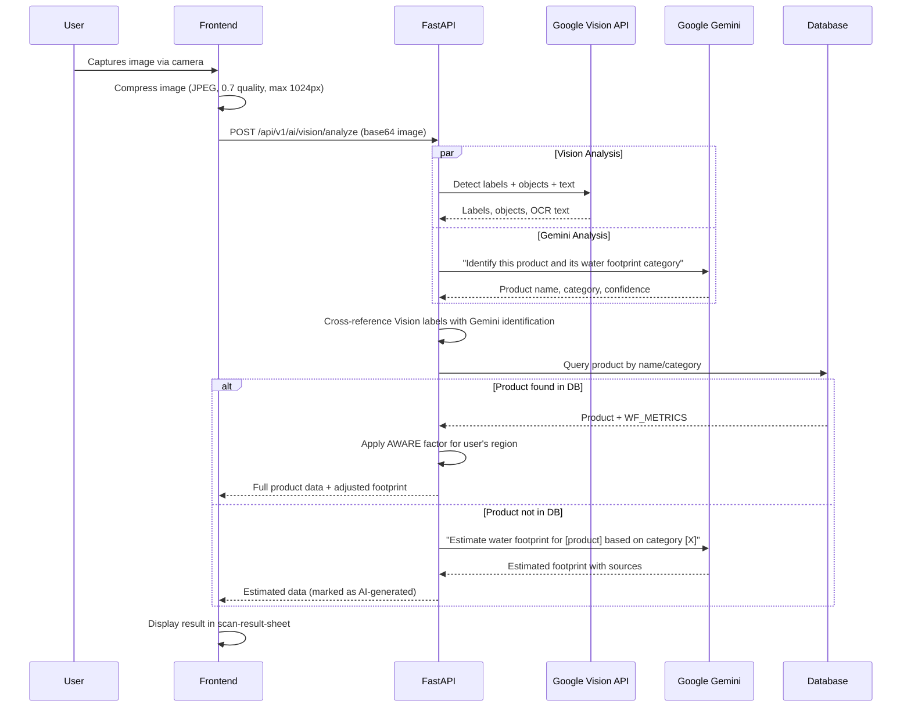

### 11.2 AI Sustainability Assistant

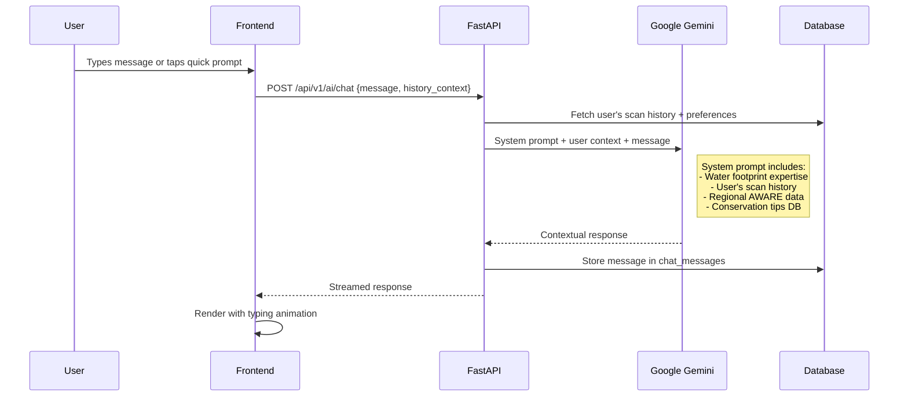

### 11.3 Why Server-Side AI?

| Factor | Client-Side TF.js (SRS Original) | Server-Side Gemini + Vision (Our Approach) |
|--------|----------------------------------|------------------------------------------|
| **Accuracy** | ~70-80% on MobileNet for consumer goods | ~95%+ with Gemini multimodal + Vision API |
| **Model Size** | 3-5MB download per user | Zero client download |
| **Product Coverage** | Limited to training dataset classes | Unbounded — Gemini has general knowledge |
| **Fallback** | No fallback if classification fails | Gemini can estimate from description |
| **Conversational AI** | Not possible | Full AI assistant capability |
| **Offline** | ✅ Works offline | ❌ Requires connection |
| **Privacy** | ✅ Images stay on device | ⚠️ Images sent to server (encrypted) |

> [!NOTE]
> The SRS emphasizes offline AI inference. We address this by: (1) caching previously scanned products locally for instant offline lookup, (2) providing text-based offline search against cached product catalog, (3) queueing scan requests when offline and processing when connection returns.

---

## 📷 12. Scanner Workflow

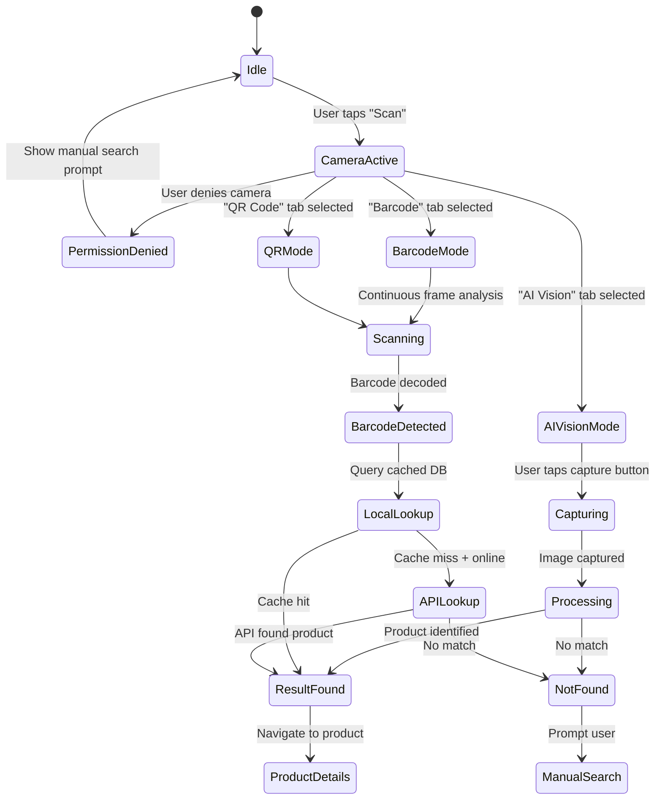

### Scanner UI States (from Stitch Design)
1. **Idle**: Camera viewfinder with corner brackets, mode tabs (AI Vision / Barcode / QR Code)
2. **Scanning**: Animated reticle, "DETECTED: ..." overlay text
3. **Processing**: Loading spinner in viewfinder
4. **Result**: Bottom sheet slides up with product summary + "View Full Details" CTA

---

## 📝 13. OCR Workflow

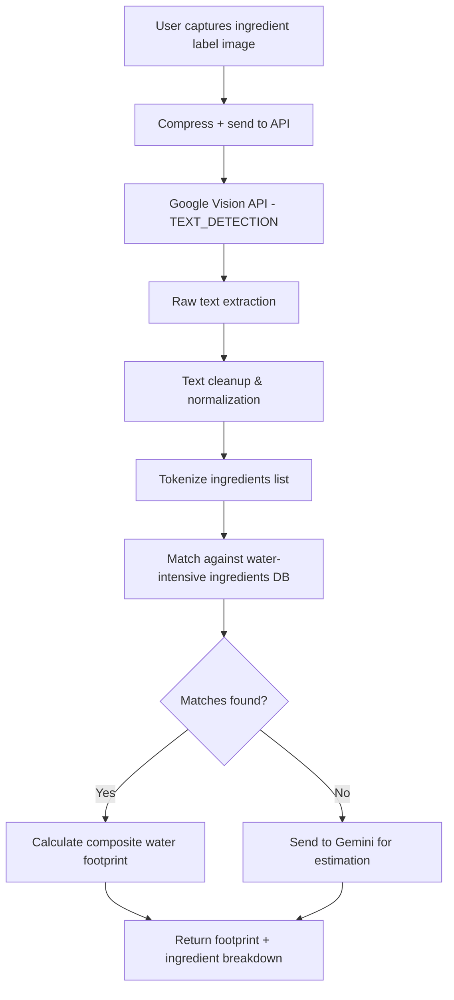

### Why Google Vision API for OCR?

| Factor | Tesseract.js (SRS Original) | Google Vision API (Our Approach) |
|--------|---------------------------|--------------------------------|
| **Accuracy on curved/glared labels** | Poor | Excellent (trained on billions of images) |
| **Language support** | Requires language packs | 100+ languages automatic |
| **Processing time** | 3-8s on mobile browser | < 1s server-side |
| **Client payload** | ~2MB WASM module | Zero client download |

---

## 📦 14. Barcode Workflow

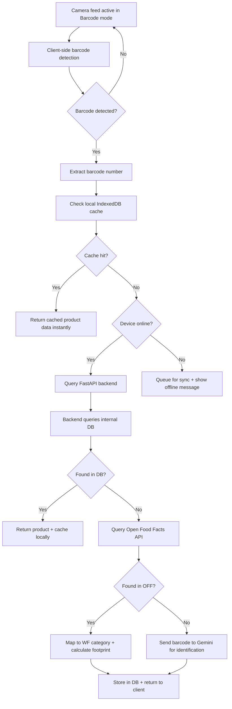

### Client-Side Barcode Detection

We use the browser's built-in `BarcodeDetector` API (available in Chrome 83+, Edge 83+) with a fallback to the lightweight `zxing-wasm` library for unsupported browsers.

**Why this approach**: Zero additional bundle size on supported browsers. The `BarcodeDetector` API is hardware-accelerated and supports EAN-13, UPC-A, QR Code — exactly the formats needed.

---

## 🧠 15. State Management Strategy

### 15.1 State Architecture Overview

```mermaid
graph TB
    subgraph "Server State (TanStack Query)"
        TQ1[products cache]
        TQ2[scan history cache]
        TQ3[leaderboard cache]
        TQ4[user profile cache]
        TQ5[chat history cache]
    end

    subgraph "Client Global State (Zustand)"
        Z1[authStore<br/>user, session, isGuest]
        Z2[scannerStore<br/>mode, isCapturing, lastResult]
        Z3[searchStore<br/>filters, query, recentSearches]
        Z4[settingsStore<br/>theme, language, hydrationGoal]
        Z5[uiStore<br/>sidebarOpen, bottomSheetState]
    end

    subgraph "URL State (searchParams)"
        U1[/search?q=...&category=...]
        U2[/compare?ids=id1,id2]
        U3[/leaderboard?region=...]
    end

    subgraph "Local Persistence"
        LS[localStorage<br/>guest UUID, theme, language]
        IDB[(IndexedDB / Dexie.js<br/>cached products, offline scans)]
    end

    Z4 <--> LS
    Z2 <--> IDB
    TQ1 <--> IDB
```

### 15.2 Zustand Store Design

```typescript
// Example: authStore
interface AuthState {
  user: User | null;
  session: Session | null;
  isGuest: boolean;
  guestUUID: string | null;
  isLoading: boolean;
  signIn: (email: string, password: string) => Promise<void>;
  signInWithGoogle: () => Promise<void>;
  enterGuestMode: () => void;
  mergeGuestData: () => Promise<void>;
  signOut: () => Promise<void>;
}

// Example: scannerStore
interface ScannerState {
  mode: 'ai-vision' | 'barcode' | 'qr-code';
  isCapturing: boolean;
  lastResult: ScanResult | null;
  scanHistory: ScanResult[];
  setMode: (mode: ScannerState['mode']) => void;
  startCapture: () => void;
  setResult: (result: ScanResult) => void;
}
```

### 15.3 TanStack Query Configuration

```typescript
// Stale times tuned per data type
const queryClient = new QueryClient({
  defaultOptions: {
    queries: {
      staleTime: 5 * 60 * 1000,      // 5 min default
      gcTime: 30 * 60 * 1000,         // 30 min garbage collection
      retry: 2,
      refetchOnWindowFocus: false,
    },
  },
});

// Per-query overrides:
// Products:      staleTime: 1 hour   (data changes rarely)
// Leaderboard:   staleTime: 30 sec   (real-time feel)
// User profile:  staleTime: 5 min    (infrequent changes)
// Chat history:  staleTime: 0        (always fresh)
```

---

## 📱 16. PWA Strategy

### 16.1 Web App Manifest

```json
{
  "name": "AquaPrint AI – Water Footprint Awareness",
  "short_name": "AquaPrint AI",
  "description": "Track, analyze, and reduce your water footprint with AI.",
  "start_url": "/dashboard",
  "display": "standalone",
  "theme_color": "#006591",
  "background_color": "#F8F9FF",
  "orientation": "portrait",
  "icons": [
    { "src": "/icons/icon-192.png", "sizes": "192x192", "type": "image/png" },
    { "src": "/icons/icon-512.png", "sizes": "512x512", "type": "image/png" },
    { "src": "/icons/icon-maskable.png", "sizes": "512x512", "type": "image/png", "purpose": "maskable" }
  ],
  "screenshots": [
    { "src": "/screenshots/dashboard.png", "sizes": "1080x1920", "type": "image/png", "form_factor": "narrow" }
  ]
}
```

### 16.2 Installation Prompt Strategy

1. User visits the landing page → Service worker registered in background
2. After 2nd visit OR 30 seconds of engagement → Show custom A2HS banner (not the browser default)
3. Custom banner uses Stitch's glass-card design language
4. Store installation state in `localStorage` to avoid re-prompting

### 16.3 PWA Implementation

**Tool**: `next-pwa` (or `@serwist/next` for Next.js 15 compatibility)

**Why**: Integrates directly with Next.js build pipeline, auto-generates service worker from Workbox config, handles precaching of static assets.

---

## 📴 17. Offline Strategy

### 17.1 Cache Layers

| Layer | Strategy | Content | TTL |
|-------|----------|---------|-----|
| **App Shell** | CacheFirst | HTML, CSS, JS bundles, fonts | Until new deployment |
| **API Responses** | StaleWhileRevalidate | Product data, search results | 24 hours |
| **Images** | CacheFirst | Product images, avatars | 7 days |
| **AI Results** | NetworkFirst | Scan results, AI responses | Not cached offline |

### 17.2 Offline Data Flow

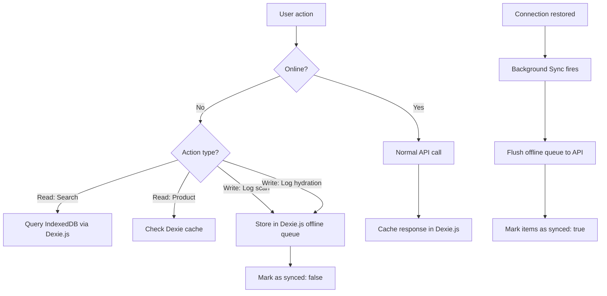

### 17.3 Offline-First IndexedDB Schema (Dexie.js)

```typescript
const db = new Dexie("AquaPrintDB");
db.version(1).stores({
  products: 'id, name, barcode, category_id, eco_grade',
  scans: '++id, product_id, user_id, scanned_at, [synced+scanned_at]',
  hydrationLogs: '++id, user_id, logged_at, [synced+logged_at]',
  searchCache: 'query, timestamp',
  userProfile: 'id'
});
```

### 17.4 Graceful Degradation

| Feature | Online | Offline |
|---------|--------|---------|
| Product search | Full API search | Local Dexie.js text search |
| AI Scanner | Full Gemini analysis | "Offline — scan queued for when you're back online" |
| Product details | Fresh data | Cached version (if previously viewed) |
| Water tracking | Real-time sync | Log locally, sync later |
| AI Assistant | Full conversation | "Connect to internet for AI assistance" |
| Leaderboard | Real-time rankings | Last cached version |

---

## 18. Security Architecture

### 18.1 Security Layers

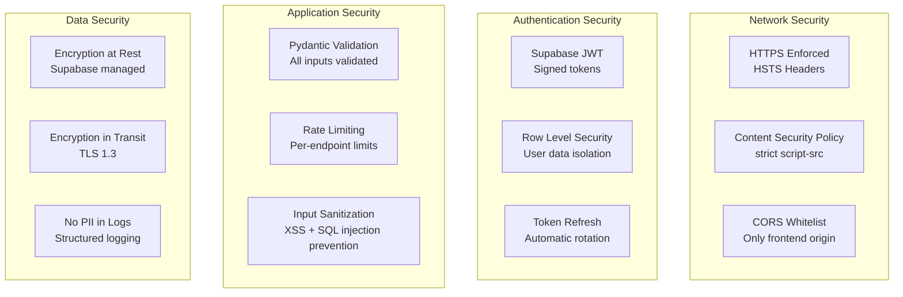

### 18.2 Security Headers (Vercel)

```json
{
  "headers": [
    {
      "key": "Content-Security-Policy",
      "value": "default-src 'self'; script-src 'self' 'unsafe-eval'; style-src 'self' 'unsafe-inline' https://fonts.googleapis.com; font-src 'self' https://fonts.gstatic.com; img-src 'self' data: https://*.googleusercontent.com https://*.supabase.co; connect-src 'self' https://*.supabase.co https://api.aquaprint.ai"
    },
    { "key": "X-Content-Type-Options", "value": "nosniff" },
    { "key": "X-Frame-Options", "value": "DENY" },
    { "key": "Strict-Transport-Security", "value": "max-age=31536000; includeSubDomains" },
    { "key": "Referrer-Policy", "value": "strict-origin-when-cross-origin" }
  ]
}
```

### 18.3 Image Upload Security

```
1. Client compresses image to max 1024px, JPEG 0.7 quality
2. Client validates file type (JPEG/PNG only) and size (< 5MB)
3. FastAPI re-validates content-type header AND magic bytes
4. Image processed in memory — never written to disk
5. Sent directly to Google Vision/Gemini API
6. Original image discarded after processing — NOT stored
```

---

## 19. Deployment Architecture

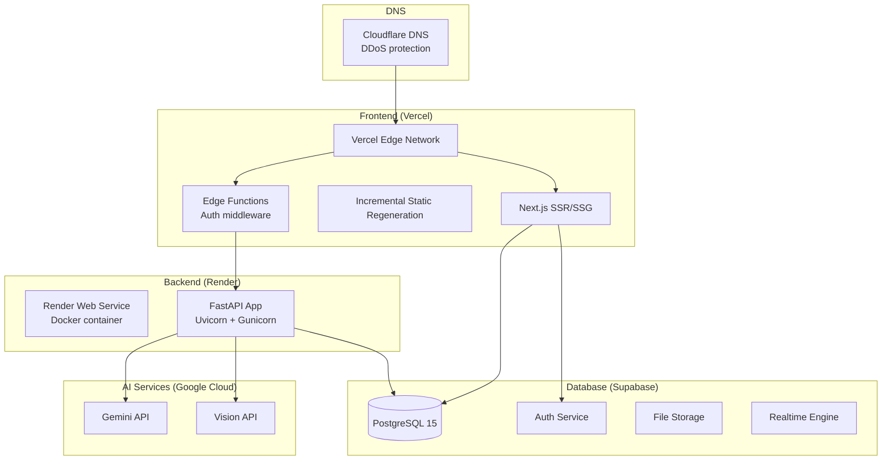

### Deployment Rationale

| Service | Why |
|---------|-----|
| **Vercel** | Zero-config Next.js deployment, global CDN, preview deployments per PR, automatic HTTPS |
| **Render** | Affordable Python hosting, Docker support, auto-scaling, managed SSL, health checks |
| **Supabase** | Free tier generous (500MB DB, 1GB storage, 50K auth users), managed PostgreSQL with extensions |
| **Cloudflare** | Free DDoS protection, DNS management, Web Application Firewall rules |

### Environment Variables

```env
# Frontend (.env.local)
NEXT_PUBLIC_SUPABASE_URL=
NEXT_PUBLIC_SUPABASE_ANON_KEY=
NEXT_PUBLIC_API_URL=
NEXT_PUBLIC_GA_TRACKING_ID=

# Backend (.env)
SUPABASE_URL=
SUPABASE_SERVICE_KEY=
DATABASE_URL=
GOOGLE_GEMINI_API_KEY=
GOOGLE_VISION_API_KEY=
CORS_ORIGINS=
JWT_SECRET=
```

---

## 20. Testing Strategy

### 20.1 Testing Pyramid

```
         ╱‾‾‾‾‾‾‾‾‾‾‾‾╲
        /   E2E Tests     \          ← 10% (critical user journeys)
       /   (Playwright)     \
      /‾‾‾‾‾‾‾‾‾‾‾‾‾‾‾‾‾‾‾‾\
     /  Integration Tests      \     ← 30% (API + component interactions)
    /  (React Testing Library   \
   /    + FastAPI TestClient)    \
  /‾‾‾‾‾‾‾‾‾‾‾‾‾‾‾‾‾‾‾‾‾‾‾‾‾‾‾‾\
 /       Unit Tests                \  ← 60% (pure functions, services)
/   (Vitest + Pytest)               \
‾‾‾‾‾‾‾‾‾‾‾‾‾‾‾‾‾‾‾‾‾‾‾‾‾‾‾‾‾‾‾‾‾‾
```

### 20.2 Testing Tools

| Layer | Frontend | Backend |
|-------|----------|---------|
| Unit | Vitest | Pytest |
| Component | React Testing Library | — |
| Integration | MSW (API mocking) | FastAPI TestClient |
| E2E | Playwright | — |
| Accessibility | axe-core | — |
| Performance | Lighthouse CI | — |

### 20.3 Critical Test Cases

| Test | Type | What It Validates |
|------|------|-------------------|
| Water footprint calculation | Unit (Pytest) | `WF_total = WF_green + WF_blue + WF_grey` precision |
| AWARE factor application | Unit (Pytest) | `WF_scarcity = WF_blue × AWARE_factor` for known regions |
| Barcode lookup flow | Integration | Cache hit → return cached; cache miss → API → cache |
| Offline scan queue | E2E (Playwright) | Scan offline → queue → reconnect → sync |
| Auth flow | E2E (Playwright) | Register → verify → login → access dashboard |
| Scanner camera permission | E2E (Playwright) | Grant → viewfinder active; deny → fallback to search |
| Product search | Integration | Query → fuzzy match → filter → sort → paginate |
| AI assistant context | Integration | Chat message includes user's scan history context |

---

## 21. Development Roadmap

### Phase Overview

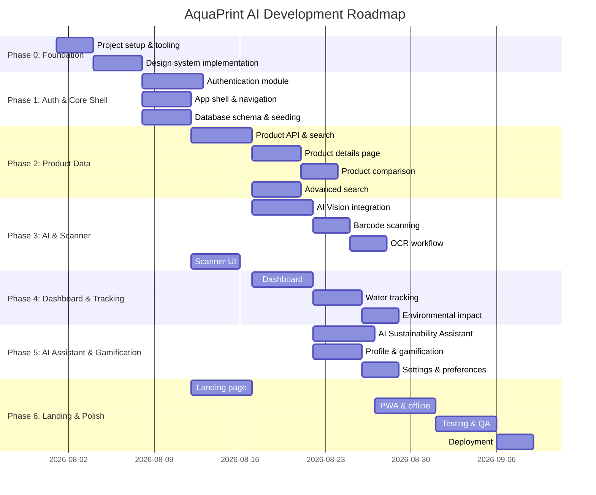

---

## 22. Module Implementation Order

> [!IMPORTANT]
> Each module depends on the previous ones being complete. This order minimizes re-work and ensures each module can be tested against real dependencies.

| Order | Module | Depends On | Deliverables | Estimated Duration |
|-------|--------|-----------|-------------|-------------------|
| **0** | **Foundation & Design System** | — | Next.js project scaffold, Tailwind config with all Stitch tokens, shadcn/ui setup, FastAPI project scaffold, Supabase project, Docker compose, CI/CD pipeline | 7 days |
| **1** | **Authentication (M2)** | M0 | Sign in, register, forgot password, OTP, Google OAuth, guest mode, auth middleware, user DB schema | 5 days |
| **2** | **App Shell & Navigation** | M0, M1 | Top app bar, bottom floating nav, sidebar (desktop), route layout, responsive shell | 4 days |
| **3** | **Database & Product API** | M0, M1 | Full DB schema migration, seed data (500+ products), product CRUD endpoints, search endpoint, fuzzy text search | 5 days |
| **4** | **Product Details (M5)** | M3 | Product hero, footprint metrics, water breakdown chart, traceability timeline, certifications, care tips, alternatives | 4 days |
| **5** | **Product Comparison (M6)** | M4 | Side-by-side comparison, savings calculator, eco-grade badges, recommendation engine | 3 days |
| **6** | **Advanced Search (M7)** | M3 | Search input, category filters, eco-rating filters, water footprint range, sort options, recent searches, trending | 4 days |
| **7** | **AI Scanner (M4)** | M3, M4 | Camera viewfinder, AI Vision mode, barcode mode, QR mode, result sheet, Gemini integration, Vision API integration | 8 days |
| **8** | **OCR Workflow** | M7 | Ingredient label capture, Vision API TEXT_DETECTION, ingredient matching, composite footprint | 3 days |
| **9** | **Dashboard (M3)** | M3, M7 | Water drop progress, hydration grid, daily insights, eco-score, weekly chart, stats grid, recent activity, daily challenges | 5 days |
| **10** | **Water Tracking (M8)** | M9 | Consumption header, AI insights, timeline, eco-impact banner, hydration logging API | 4 days |
| **11** | **Environmental Impact (M9)** | M9, M10 | Real-time charts, global rank, efficiency metrics, optimization recommendations | 3 days |
| **12** | **AI Assistant (M10)** | M7 | Chat interface, Gemini integration with user context, quick prompts, typing indicator, chat history | 5 days |
| **13** | **Profile & Gamification (M11)** | M1, M9 | Profile header, impact circles, badges grid, scan history, saved products, leaderboard | 4 days |
| **14** | **Settings (M12)** | M1, M13 | User profile editing, hydration goals, notifications, theme toggle, language switch | 3 days |
| **15** | **Landing Page (M1)** | M0, M2 | Hero with WebGL shader + Three.js globe, stats, how-it-works, categories carousel, scanner preview, features, testimonials, FAQ, newsletter, footer | 5 days |
| **16** | **PWA & Offline** | All modules | Service worker, manifest, A2HS prompt, Dexie.js offline cache, background sync, offline indicator | 5 days |
| **17** | **Testing & Polish** | All modules | Unit tests, integration tests, E2E tests, Lighthouse optimization, accessibility audit, cross-browser testing | 5 days |
| **18** | **Deployment** | M17 | Vercel deployment, Render deployment, Supabase production config, domain setup, monitoring | 3 days |

**Total Estimated Duration: ~83 days (~12 weeks)**

---

## 23. GitHub Repository Structure

```
AquaPrintAI/
├── .github/
│   ├── workflows/
│   │   ├── frontend-ci.yml          # Lint, type-check, test, build
│   │   ├── backend-ci.yml           # Lint, type-check, test
│   │   ├── e2e.yml                  # Playwright E2E tests
│   │   └── deploy.yml               # Production deployment
│   ├── ISSUE_TEMPLATE/
│   │   ├── bug_report.md
│   │   └── feature_request.md
│   └── PULL_REQUEST_TEMPLATE.md
├── frontend/                         # (see Folder Structure above)
├── backend/                          # (see Folder Structure above)
├── docs/
│   ├── architecture.md
│   ├── api-reference.md
│   ├── deployment-guide.md
│   └── contributing.md
├── .env.example
├── .gitignore
├── docker-compose.yml
├── LICENSE
└── README.md
```

### Branch Strategy

```
main          ← Production (auto-deploys to Vercel + Render)
├── develop   ← Integration branch
│   ├── feature/M0-foundation
│   ├── feature/M1-auth
│   ├── feature/M2-app-shell
│   └── ...
└── hotfix/*  ← Emergency production fixes
```

### Commit Convention
```
feat(scanner): implement barcode detection with BarcodeDetector API
fix(auth): handle expired refresh token edge case
docs(api): add endpoint documentation for /api/v1/products
test(footprint): add AWARE factor calculation unit tests
chore(deps): upgrade next.js to 15.1.0
```

---

## 24. Coding Standards

### 24.1 Frontend Standards

| Category | Standard | Enforcement |
|----------|----------|------------|
| **TypeScript** | `strict: true`, no `any`, explicit return types on exports | `tsconfig.json` + ESLint |
| **Components** | Functional components only, named exports, Props interface co-located | ESLint rule |
| **File naming** | `kebab-case.tsx` for components, `camelCase.ts` for utilities | ESLint |
| **Imports** | Absolute imports via `@/` alias, sorted by category | `eslint-plugin-import` |
| **CSS** | Tailwind utility classes only (no inline styles), design tokens only (no arbitrary values) | Tailwind config |
| **Accessibility** | All interactive elements have `aria-label`, all images have `alt`, keyboard navigable | `eslint-plugin-jsx-a11y` |
| **Error handling** | Error boundaries at route level, toast notifications for user-facing errors | Custom ErrorBoundary component |
| **Performance** | `React.lazy()` for heavy components, `next/image` for all images, memoize expensive computations | Bundle analyzer CI check |

### 24.2 Backend Standards

| Category | Standard | Enforcement |
|----------|----------|------------|
| **Python** | Python 3.12+, type hints on all functions, docstrings on public functions | `mypy` + `ruff` |
| **API responses** | Always return `{ status, data, meta }` or `{ status, error }` | Pydantic response models |
| **Validation** | All inputs validated via Pydantic schemas, never trust client data | FastAPI dependency injection |
| **SQL** | No raw SQL in routers, use SQLAlchemy ORM, parameterized queries only | Code review |
| **Secrets** | Never hardcode, always from environment variables via `pydantic-settings` | `.env` + CI checks |
| **Logging** | Structured JSON logging, no PII, request ID correlation | `structlog` |
| **Error handling** | Custom exception classes, global exception handler, meaningful HTTP status codes | FastAPI exception handlers |

### 24.3 Shared Standards

- **Git**: Conventional Commits, PR reviews required, squash merge to develop
- **Documentation**: README in every major directory, API docs auto-generated from Pydantic
- **Environment**: All config via `.env`, never committed, `.env.example` as template

---

## 25. Risks and Mitigation

| # | Risk | Impact | Probability | Mitigation |
|---|------|--------|------------|------------|
| R1 | **Google API rate limits** exceeded during peak usage | High | Medium | Implement aggressive caching (TanStack Query + Dexie.js), batch Vision API calls, use Gemini's free tier quota wisely, implement request queuing |
| R2 | **Camera permissions denied** on mobile browsers | Medium | High | Graceful fallback to manual text search + image upload. Clear permission rationale in UI. |
| R3 | **Supabase free tier limits** reached | High | Medium | Monitor usage via Supabase dashboard. DB connection pooling via Supavisor. Plan upgrade path to Pro tier ($25/mo). |
| R4 | **Offline-to-online sync conflicts** | Medium | Medium | Last-write-wins strategy for user data. Append-only for scans (no conflicts). Conflict resolution UI for edge cases. |
| R5 | **Water footprint data accuracy** | High | Medium | Use verified WFN and ISO 14046 sources. Mark AI-estimated data distinctly. Community reporting mechanism. Regular data audits. |
| R6 | **Large IndexedDB on low-end devices** | Medium | Medium | LRU eviction when storage exceeds 80% quota. Only cache product metadata (not images). Monitor via `navigator.storage.estimate()`. |
| R7 | **Three.js/WebGL shader performance** on landing page | Low | Medium | Lazy load Three.js only on landing page. Detect WebGL support; fallback to static hero image. Use `requestAnimationFrame` pause when tab inactive. |
| R8 | **SEO for dynamic content** | Medium | Low | Next.js SSR/SSG for all public pages. Structured data (JSON-LD) for products. Dynamic `<meta>` tags via Next.js Metadata API. |
| R9 | **Gemini API response latency** for AI assistant | Medium | Medium | Streaming responses (SSE) for progressive rendering. Loading animation (Stitch's typing indicator). Timeout at 15s with retry. |
| R10 | **Cross-browser camera API inconsistencies** | Medium | High | Feature detection for `BarcodeDetector` and `getUserMedia`. Polyfills for older browsers. Explicit browser support matrix in docs. |

---

## Open Questions

> [!IMPORTANT]
> The following questions will impact implementation decisions. Please clarify before we begin coding.

1. **Supabase Project**: Do you already have a Supabase project created, or should I plan the setup as part of Module 0?

2. **Google API Keys**: Do you have existing Google Cloud project with Gemini and Vision API enabled, or should I document the setup?

3. **Domain Name**: Is there a custom domain for the project (e.g., `aquaprint.ai`), or will we use Vercel's default subdomain initially?

4. **Product Seed Data**: The SRS mentions Water Footprint Network data. Should I create a synthetic seed dataset of ~500 common Indian products for initial development?

5. **Multilingual Scope**: The SRS specifies English + Hindi + Marathi. Should we implement all three from the start, or English first with i18n infrastructure ready for expansion?

6. **Dark Mode**: The Stitch design system provides both light and dark mode specs (AI Assistant screen is dark). Should dark mode be implemented from the start or added later?

---

## Verification Plan

### Automated Tests
```bash
# Frontend
cd frontend && npm run lint && npm run type-check && npm run test && npm run build

# Backend
cd backend && ruff check . && mypy app/ && pytest tests/ -v

# E2E
cd frontend && npx playwright test
```

### Manual Verification
- Visual comparison of every screen against Stitch screenshots
- Camera scanning workflow on physical Android + iOS devices
- Offline mode testing (airplane mode → scan → reconnect → verify sync)
- Lighthouse audit > 90 on all 4 categories
- Accessibility audit with screen reader (VoiceOver / TalkBack)

---

> **NEXT STEP**: Approve this blueprint, and I will begin implementing **Module 0: Foundation & Design System** — the project scaffold, Tailwind configuration with all Stitch design tokens, shadcn/ui setup, FastAPI scaffold, and Docker compose for local development.


---

## 🤝 Contributing

This blueprint is intended to guide the complete implementation of AquaPrint AI.
Contributions should maintain consistency with the documented architecture and engineering decisions.

## 📄 License

This documentation is intended for the AquaPrint AI project.

<div align="center">

**Built for sustainable technology 🌍**

</div>
